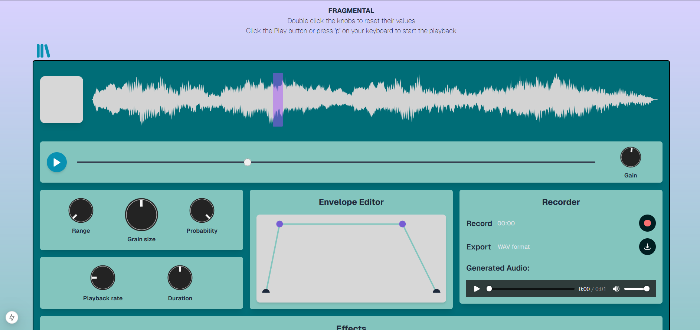
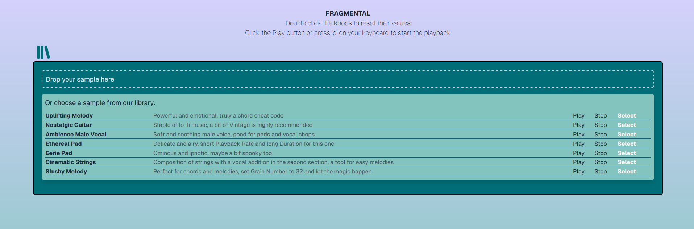
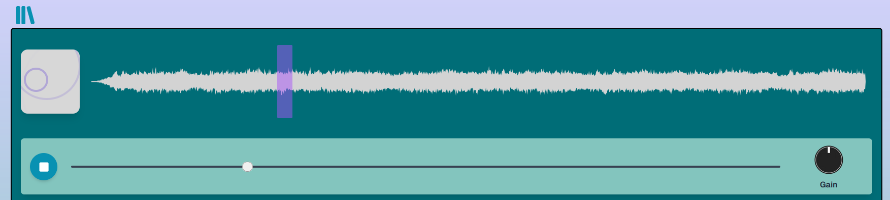
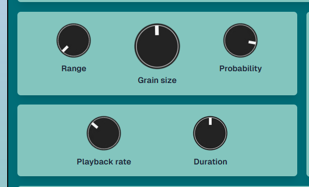
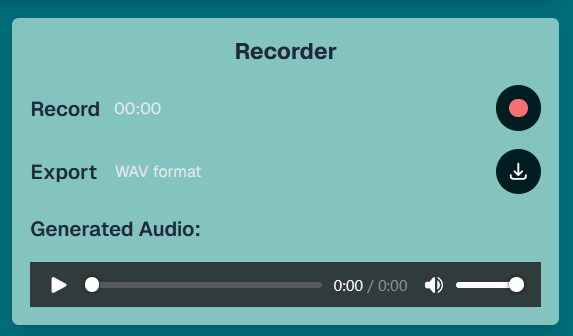

## What is Fragmental?
Fragmental is a web-based granular synthesizer that allows users to explore granular synthesis creatively without requiring deep technical knowledge.

## What is granular synthesis?
Granular synthesis is a sound processing technique that involves splitting audio into small 'grains' and manipulating them to create new textures, tones, and effects. It's widely used in music production and sound design.



## If you want to run the app locally

Install the necessary dependencies (if needed):
```bash
npm install next react react-dom
npm install
```
Run the development server:

```bash
npm run dev
```

Open [http://localhost:3000](http://localhost:3000) with your browser to see the result.

## Cut the chatter, let's get to it
There are two ways to begin exploring Fragmental. The first option involves using the dropzone, where you can upload your own sample to the synthesizer. If you doubt which sample to use, we recommend trying pads, sounds with smooth transitions or longer chords. If you prefer to dive right in or don’t have your own sample collection, no problem — you can pick one from the library!




## Hit play and let magic happen 
At the top of the screen, you can interact with the uploaded sample using a waveform window and a slider. The position of the slider indicates the grain from which playback starts, serving as a pivot point for all subsequent audio processing algorithms. To make the user experience more engaging and interactive, a visual effects window on the left has been added. It displays the grain's behavior, synchronized with the playback.


## Knobs rack 
On the left side of the page, the knob rack is located. It is split into two parts: the upper section controls the grain settings, while the lower section manages the playback rate and duration of each grain.
- Range - defines the range for selecting grains;
- Grain size - specifies the length of each grain, which also affects the total number of grains;
- Probability - determines the likelihood of each individual node being skipped;
- Playback rate - controls how quickly grains are played one after another;
- Duration - sets how long each grain plays.



## Envelope
An envelope is used to shape and control how a sound's velocity behaves. For this project an ADSR envelope was utilized.  
- Attack: the time it takes for the sound to reach its maximum level after being triggered;
- Decay: the time it takes for the sound to drop from its peak level to a sustain level;
- Sustain: the level at which the sound remains while the note is held;
- Release: the time it takes for the sound to fade out to silence after the note is released.


## Recorder 
If you want to export your results to your favorite DAW or share your work with friends, there's a Recorder made just for you! Simply hit record, then export. Light and simple.



## Effects
At the bottom of the page is the Effect Rack.
The knobs presented control a combination of multiple simple effects, like reverb, delay, distortion, etc...
The composite effects created until now are:
- Vintage (Low-pass, Bitcrusher, Reverb), for a lo-fi analog vibe;
- Dreamy (High-pass, Chorus, Reverb, Delay), for an ethereal feeling with a dragged sound;
- Robot (Autofilter, Distortion, Plate Reverb), for adding an electric and resonating layer;
- Bubbly (Phaser, Tremolo), for a funky and wobbly effect.


## Dependencies 
- Tone.js
- Next.js
- React + Node.js
- Wavesurfer library
- Firebase 

## Docs
- https://react-dropzone.js.org/
- https://wavesurfer.xyz/docs/

